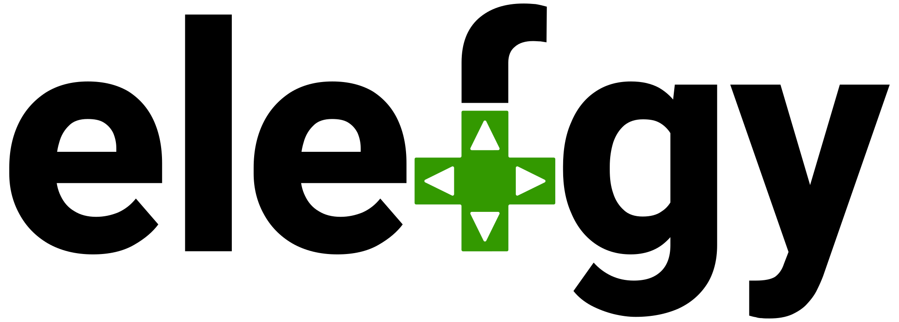

# *noun*, el·ef·jee, [ɛl.ɛf.dʒi]

An online community and web app to help connect gamers. Named after the verbal
pronunciation of the commonly used abbreviation 'LFG' for the phrase 'looking
for group'. The goal is to give all gamers an easy-to-use cross-platform way to
meet other like-minded gamers of any of their chosen games. From co-op in the
latest battle-royale on whichever console to just sharing moments in an
old-school single-player role-playing game.

# When?

RiskyWhiskey is currently a one-man development team but hopefully there will
be a working beta in 2022.

# Ethical Coding

In this project the code is open source for integrity, transparency, and
security. User data is securely held encrypted in server space. We will strive
to deliver a quality product for our users trust while complying with best 
practices. No manipulative algorithms or wedging blockchain into where it
doesn't belong.

# Contributing

A document outlining code contribution and issuing bugs can be found in the wiki
[here](https://github.com/RiskyWhiskey/elefgy/wiki/Contributing-To-elefgy).

# Change Log

All changes between releases can be found in the wiki page
[here](https://github.com/RiskyWhiskey/elefgy/wiki/elefgy-Change-Log).

# Special Thanks To

## Core Team

## Contributors

## Patrons

# License

Copyright © 2019-2022 [RiskyWhiskey](https://riskywhiskey.com), Ian Whitnall
([@NyxTheMage](https://github.com/NyxTheMage))

This Source Code Form is subject to the terms of the Mozilla Public License,
v. 2.0, [LICENSE.md](LICENSE.md). If a copy of the MPL was not distributed
with this file, You can obtain one at http://mozilla.org/MPL/2.0/.
